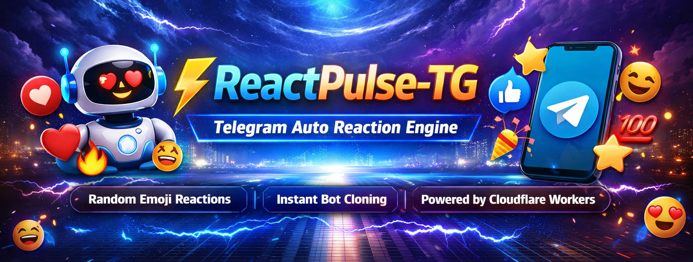

<p align="center">
  
</p>

<p align="center">
  <b>Automatic Telegram emoji reaction bot powered by Cloudflare Workers.</b>
</p>

<h1 align="center">ReactPulse-TG — Telegram Auto Reaction Engine</h1>

<p align="center">
  <b>Let Your Bot React Instantly ⚡</b><br>
  Developed by <a href="https://www.amitdas.site/">Amit Das</a>
</p>

---

## 🚀 Overview

ReactPulse-TG is a powerful **Telegram Auto Reaction Bot** built with **Cloudflare Workers**.

It automatically reacts to messages with **random emojis** across Telegram chats.

The project also includes a **web interface to clone the bot instantly**, allowing users to deploy their own reaction bot by simply entering their **Bot Token**.

No servers required — everything runs on **Cloudflare Edge**.

---

## ⚡ Core Features

- Random emoji reactions
- Works in private chats
- Works in groups & supergroups
- Channel post reaction support
- Safe reactions for channel messages
- Automatic emoji fallback system
- Web-based bot cloning interface
- Auto webhook setup
- Auto menu mini-app configuration
- Auto command & description setup
- Fully serverless deployment
- Built for Cloudflare Workers

---

## 🧠 How It Works

1. Telegram sends updates to your Cloudflare Worker via webhook
2. Worker receives the message
3. Worker detects chat type (private / group / channel)
4. Worker selects a random emoji
5. Bot reacts automatically using `setMessageReaction`

Channel posts use **safe emojis** to avoid Telegram restrictions.

---

## 🌐 Webhook Setup

Set webhook for your bot:

```bash
https://api.telegram.org/bot<BOT_TOKEN>/setWebhook?url=https://your-worker.workers.dev/?token=<BOT_TOKEN>
````

---

## 📦 Deployment

### 1️⃣ Deploy to Cloudflare Workers

Upload your `worker.js` script.

### 2️⃣ Set Webhook

Replace `<BOT_TOKEN>` with your bot token.

```bash
https://api.telegram.org/bot<BOT_TOKEN>/setWebhook?url=https://your-worker.workers.dev/?token=<BOT_TOKEN>
```

### 3️⃣ Start the Bot

Send `/start` to your bot in Telegram.

---

## 🤖 Bot Commands

| Command  | Description                      |
| -------- | -------------------------------- |
| `/start` | Start the bot and open main menu |

---

## 🌟 Reaction System

ReactPulse-TG automatically reacts with emojis such as:

```
⭐ ❤ 👍 🔥 🎉 😁 🥰 👏 🤯 😢 🤩 💯 ⚡ 🍌 🏆 👀 😎
```

### Channel Safe Reactions

For channel posts the bot uses safe emojis:

```
👍 ❤ 🔥 🎉 👏 😁
```

---

## 🎛 Clone Bot Web Interface

ReactPulse-TG includes a **web UI** to clone the bot instantly.

Features:

* Paste bot token
* Auto set webhook
* Configure mini app menu
* Setup bot commands
* Update bot description

Users can create their own **reaction bot in seconds**.

---

## 📁 Project Structure

```
ReactPulse-TG
 ├ worker.js
 ├ README.md
 ├ img/
 │   └ banner.png
 └ LICENSE
```

---

## 🧩 Use Cases

### Telegram Community Engagement

Automatically react to messages to increase interaction.

### Fun Group Bots

Add reactions in group chats automatically.

### Channel Interaction

React to forwarded channel posts in groups.

### Telegram Bot Experiments

Great project to learn **Telegram Bot API + Cloudflare Workers**.

---

## 🔒 Security

* No user data stored
* Uses official Telegram Bot API
* Runs on Cloudflare edge network
* No external databases required

---

## ⚠️ Requirements

Before using the bot:

* Bot must be added to the chat
* Bot must have permission to read messages
* `/setprivacy` disabled via BotFather

---

## 📬 Support

<p align="center">
  <a href="https://t.me/Thamaraiselvi69">
    
  </a>
</p>

---

## 📜 License

MIT License © 2026 Amit Das

---

<p align="center">
  <b>Built with ⚡ using Cloudflare Workers</b><br>
  Made with ❤️ by <a href="https://amitdas.site">Amit Das</a>
</p>
